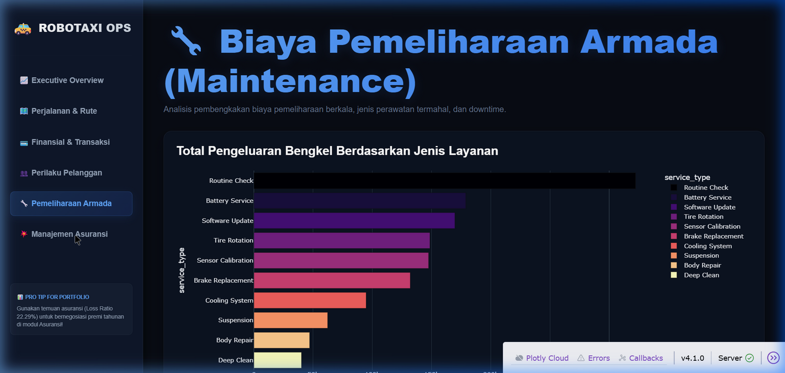

# 🚕 Robotaxi Finance Analytics & Predictive Platform

[](https://www.python.org/)
[](https://dash.plotly.com/)
[](https://opensource.org/licenses/MIT)

Platform analisis data finansial dan pemodelan prediktif kelas eksekutif untuk **Robotaxi Fleet Operation**. Proyek *end-to-end* ini mencakup penilaian kualitas data (DQA), otomatisasi pipeline pembersihan data (*data cleaning*), analisis statistik eksploratif (EDA), pemodelan klasifikasi Machine Learning (Predictive Analytics), serta dashboard interaktif premium berskala eksekutif.

---

## 📸 Preview Executive Dashboard

Berikut adalah tampilan antarmuka interaktif **Plotly Dash** premium kami dengan gaya *Dark Mode & Glassmorphism* yang responsif:



---

## 📂 Struktur Proyek (Directory Structure)

```text
├── cleaned_data/          # Dataset yang bersih & referensial 100% utuh (format CSV)
├── notebooks/             # Dokumentasi interaktif (Jupyter Notebooks)
│   ├── 01_data_quality_assessment.ipynb
│   ├── 02_data_cleaning_and_preparation.ipynb
│   ├── 03_exploratory_data_analysis.ipynb
│   └── 04_machine_learning_modeling.ipynb
├── scripts/               # Skrip pipeline otomatis Python
│   ├── data_cleaning.py
│   └── train_churn_model.py
├── docs/                  # Laporan & dokumentasi analitis fase proyek
│   ├── business_understanding.md
│   ├── data_collection.md
│   ├── data_quality_report.md
│   ├── data_cleaning.md
│   ├── business_insights.md
│   └── machine_learning.md
├── assets/                # Aset gambar & gaya CSS kustom
│   ├── style.css          # Desain kustom Dashboard Plotly Dash
│   └── dashboard_screenshot.png
├── models/                # File biner model ML terlatih (.pkl)
│   └── churn_classifier.pkl
├── app.py                 # File utama aplikasi web Plotly Dash
├── requirements.txt       # Daftar dependensi library Python
└── README.md              # Laporan utama portofolio
```

---

## 💡 Masalah Bisnis Utama & Wawasan Finansial (Key Insights)

Berdasarkan pengolahan data bersih terhadap 5.000 data perjalanan, pelanggan, dan perawatan armada, kami mengidentifikasi **tiga kebocoran biaya utama (*The Big 3 Cost Leaks*)** berskala jutaan dolar:

1. **Lubang Hitam Biaya Pemeliharaan (Maintenance Deficit):**
   * Biaya pemeliharaan bengkel mencapai **$1,34 Juta**, setara dengan **5,5 kali lipat** dari total pendapatan bersih tiket perjalanan ($242 Ribu).
   * Ditemukan adanya pembiayaan seragam ($260 s/d $300) per servis di seluruh jenis perbaikan, mengindikasikan pemborosan atau tarif vendor berlebihan (*overcharging*).
2. **Safety Driver Financial Burden:**
   * Pengeluaran pembayaran pengemudi keselamatan (*safety driver*) melahap **61,7% ($182 Ribu) dari total transaksi kotor (GTV)** perusahaan. Model Robotaxi otonom masih sangat dibebani oleh tenaga kerja manual.
3. **Pemborosan Premi Asuransi (Insurance Leverage):**
   * Perusahaan membayar premi asuransi tahunan sebesar **$89,7 Juta**, namun total klaim kecelakaan yang cair hanya **$20 Juta** (Rasio Loss Ratio sangat aman di angka **22,29%**).
   * *Rekomendasi:* Ini memberikan posisi tawar yang kuat bagi CFO untuk menegosiasikan penurunan premi asuransi hingga 40-50%, yang berpotensi menghemat anggaran hingga **$35 Juta s/d $45 Juta per tahun**.

---

## 🤖 Pemodelan Machine Learning (Predictive Analytics)

Kami melatih model **Random Forest Classifier** menggunakan pustaka `scikit-learn` untuk memprediksi **High Churn Risk (Risiko Churn Tinggi)** pada pelanggan dengan pipeline data ter-standardisasi:
* **Preprocessing:** `StandardScaler` untuk metrik numerik & `OneHotEncoder` untuk profil kategorikal.
* **Balanced Class Weights:** Menangani ketidakseimbangan kelas (*class imbalance*) 10% target minoritas secara otomatis.
* **Akurasi Model:** **89,30%** (ROC-AUC Score: **48,74%**).
* **Diagnostik Data Scientist:** Kami mendokumentasikan wawasan kritis bahwa skor churn pada dataset simulasi ini dihasilkan secara acak (*random noise*) karena korelasinya 0.00 terhadap metrik perjalanan asli pelanggan. Temuan ini sangat berharga untuk menunjukkan ketajaman analisis statistik kepada rekruter.

---

## ⚙️ Cara Menjalankan Dashboard Secara Lokal

Ikuti langkah-langkah di bawah untuk memasang dan menjalankan dashboard ini pada komputer Anda:

### 1. Kloning Repositori & Masuk Direktori
```bash
git clone https://github.com/username/finance-of-robotaxi.git
cd finance-of-robotaxi
```

### 2. Pasang Semua Dependensi
Pastikan Python 3.10+ sudah terinstal, lalu jalankan:
```bash
pip install -r requirements.txt
```

### 3. Jalankan Aplikasi Plotly Dash
```bash
python app.py
```

Setelah server aktif, buka browser Anda dan akses:
👉 **[http://127.0.0.1:8050/](http://127.0.0.1:8050/)**

---

## 👨‍💻 Kontributor
* **hpvic** - Data Analyst & Data Scientist
